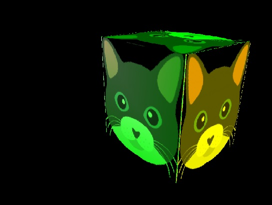

# Hello world
Various hello world program on C/C++ languages.
And also probe work with GitHub.
Additional information present in ReadMe.txt files in respective directorie's.

- Hello world round one [ReadMe](hello_world_one/ReadMe.txt)
- Hello world round two [ReadMe](hello_world_two/ReadMe.txt)
- Hello world round three [ReadMe](hello_world_three/ReadMe.txt)

## Example

